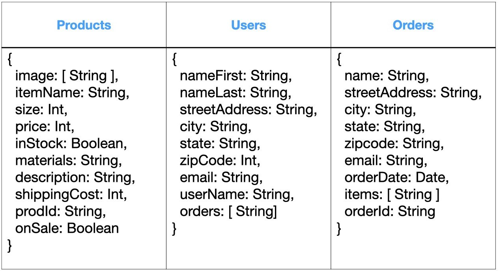
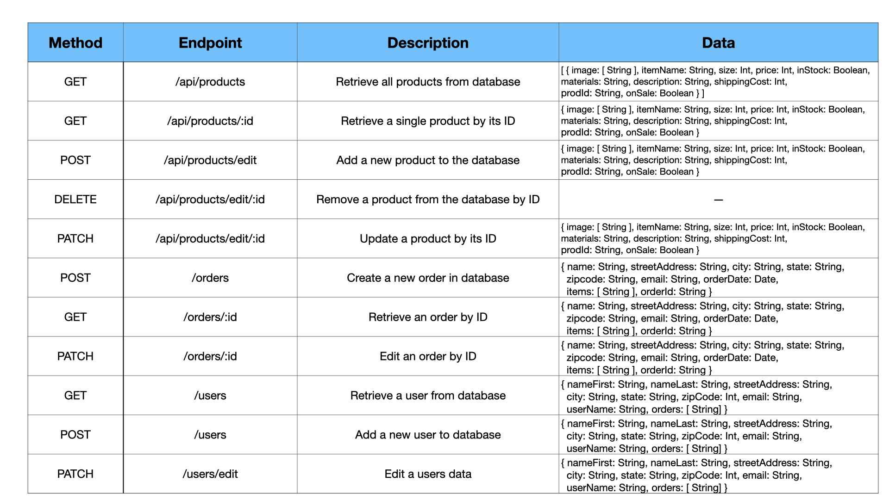

# Health Scents by RR Store

> Single Page Application Store for a small Aroma Therapy/Essential Oil company

## Table of Contents

1. [Description](#description)
1. [Technologies](#technologies)
1. [Development](#development)
1. [Schema and API's](#schema_and_api's)//finish app and get gifs for this section

## Description

The goal of this app was to create a SPA store front that could be added to an existing website but would fell like multiple new pages on the existing site. This required combining React Router with server view routes, along with React components that find their single source of truth in the database instead of relying solely on state. The end result is a store front that can be refreshed, urls can be copy pasted, and bookmarked.

I chose to use Mongo Atlas to host the database for 2 reasons. First, using Atlas gave provided a deployed database at a low cost choice for what is currently a small application. Second, Atlas encryps the data for extra protection of user data that made sense to abstract for this applicaiton.

The Front end was created with React, and React Router. React Hooks were used instead of class components to make future scaling easier, and to make it easer to reuse logic as the app grows. UI was designed with material-UI for theming convenience and built in responsive functionality.

> This is currently a work in progress, as authentication needs to be added to the server routes, and styling needs to be finished

### Currently working on:

Authentication
* Build Authentication middleware for Order routes, User routes and specific Product routes
* Add JWT, and bcrypt. Hash user passwords to save in database
* Set up functionality to do password resets for locked out users
* Build login and out pages for front end
* Build admin page to make changes to products and orders

Styling
* Finish styling of Front End components

## Technologies
* Javascript
* Nodejs
* Express
* Mongoose
* Mongo Atlas
* React
* React Router
* Webpack

## Schema and API's

### API Table

